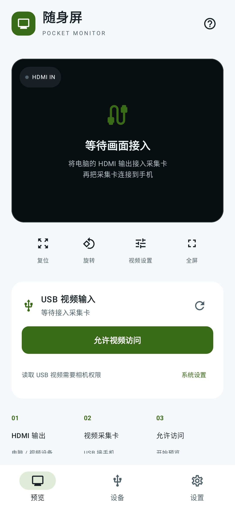

<h1 align="center">Pocket Monitor · 随身屏</h1>

<p align="center"><strong>View your computer’s HDMI output on your Android phone.</strong></p>
<p align="center"><strong>English</strong> · <a href="README.zh-CN.md">简体中文</a> · <a href="#quick-start">Quick start</a> · <a href="https://github.com/ttermish/pocket-monitor/issues">Report an issue</a></p>

Pocket Monitor is a portable video monitor app. Connect your computer’s HDMI output to a USB video capture card, then connect the card to your phone to preview the picture. No sender software is needed on the computer.

Use your phone as a temporary small display to check another computer’s video output. The current **0.1.2 development build supports Android 8.0 and later**. Individual phone and capture-card combinations still need hardware testing.

## Preview

<p align="center">
  
</p>

The home screen puts connection and picture controls together. This is an automated rendering of the actual app UI with no capture card connected. Real HDMI capture has not yet been validated. The app currently displays Chinese labels; the English instructions below include them to help you find each control.

## What you can do

- **Preview HDMI video:** receive a computer or other device’s picture through a UVC capture card.
- **Inspect details:** pinch to zoom, drag the picture, switch to fullscreen or rotate in 90° steps.
- **Choose a capture format:** select a resolution and frame rate reported by your card.
- **Remember a working format:** after at least three seconds of continuous frames, save the format for that card model and prefer it next time.
- **Keep video local:** no video recording or uploading. Capture stops in the background and attempts to resume when you return.

This version previews video only. Audio, recording, screenshots, keyboard/mouse control and an iPhone app are not available.

## What you need

| Item | Requirements |
| --- | --- |
| Android phone | Android 8.0+, with USB Host / OTG support. Some phones require enabling OTG in system settings. |
| UVC video capture card | HDMI IN connects to the computer; USB connects to the phone. |
| HDMI and data cables | Use an OTG adapter if needed and a USB cable that supports data transfer. |
| HDMI source | A computer or other device with HDMI output. USB-C-only computers need an adapter that supports video output. |

**A regular USB-C-to-HDMI display cable is not a capture card.** The capture card converts HDMI input into USB video the phone can read.

## Install

[Download the signed Android APK](https://github.com/ttermish/pocket-monitor/releases/download/v0.1.2/pocket-monitor-0.1.2-release.apk) · [Release notes, source and checksums](https://github.com/ttermish/pocket-monitor/releases/tag/v0.1.2)

Repository access is required while this project is private. Developers can also use the [build guide](docs/DEVELOPMENT.md).

Open the APK on your phone and allow installation from that source when prompted. Release packages use a dedicated signing key; local Debug packages use a different signature. A Release APK cannot update an existing Debug installation directly. Uninstalling the previous version clears saved capture formats. An AAB is intended for store distribution and cannot be installed directly.

## Quick start

### 1. Connect your computer, capture card and phone

```text
Computer HDMI OUT → HDMI cable → Capture card HDMI IN
                                      │
                                  USB / OTG
                                      │
                                 Android phone
```

Connect the HDMI side to the video source and the USB side to your phone. Make sure the computer is outputting a picture and OTG is enabled if your phone requires it.

### 2. Open Pocket Monitor and allow access

Tap **Allow video access (允许视频访问)** and grant camera permission. Once a device is found, tap **Connect capture card (连接采集卡)** and allow access in the system USB dialog. If no device appears, tap refresh or **Find capture card (查找采集卡)**.

With multiple capture cards attached, choose one in **Video settings (视频设置)**. Start with just one card to make the input easy to identify.

### 3. Set your computer’s display output

On a Mac, open **System Settings → Displays**. Choose mirroring to see the same desktop on your phone. With an extended display, move a window to the new display.

Start by trying a 1920 × 1080, 60 Hz computer output and the app’s preferred 720p / 30 fps MJPEG capture format. HDMI output and USB capture settings can differ; available formats depend on the card.

## Adjust the picture

| Action | How to use it |
| --- | --- |
| Fullscreen | Tap **全屏**; use the top-right button to exit. |
| Rotate | Each tap on **旋转** rotates the picture by 90°. |
| Zoom and pan | Pinch in the preview, then drag to inspect details. |
| Reset | Double-tap the picture to reset zoom and position. **复位** also resets rotation. |
| Change format | Once connected, open **视频设置** and choose a supported resolution, frame rate and encoding. |
| Stop | Tap **停止预览**, or disconnect in **视频设置**. |

Higher settings are not always smoother: USB bandwidth, the card and phone power all matter. The app prefers MJPEG close to 720p / 30 fps. Working formats are remembered by card model, so identical models share the setting.

## Troubleshooting

**No capture card found:** check OTG, the data cable, adapters and power. Make sure this is a UVC capture card; a regular display cable cannot receive video.

**Access was denied:** tap the permission button again. If Android no longer prompts, open **System settings (系统设置)**, allow camera access, then reconnect and allow USB access.

**The device cannot be opened:** close other apps using the card, unplug it and reconnect.

**Color bars or black video with a “live” indicator:** some cards generate their own no-signal picture. Receiving frames does not prove the computer is outputting correctly. Check HDMI, display settings and power. HDCP-protected content is outside the supported scope.

**Waiting for frames or an interrupted stream:** after eight seconds without startup frames, the app tries up to two lower-format reconnects. If that fails, check the wiring or choose a format manually in **视频设置**. A stream that stops after producing frames will not repeatedly reconnect automatically.

**Capture stops in the background:** this is expected. Capture runs only while the app is in the foreground and attempts to resume on return. Reconnect manually if needed.

## Feedback and contribution

[Open an issue](https://github.com/ttermish/pocket-monitor/issues) with your phone model, Android version, capture-card model, selected format and reproduction steps. Reports from real hardware are welcome. Remove personal information from logs and screenshots before sharing.

- [Contributing](CONTRIBUTING.md) · [Security reports](SECURITY.md)
- [Development and builds (中文)](docs/DEVELOPMENT.md) · [Development conventions (中文)](AGENTS.md)
- [Changelog (中文)](CHANGELOG.md) · [Validation record (中文)](docs/VALIDATION.md)
- [Third-party components and licenses](THIRD_PARTY_NOTICES.md) · [Release preparation (中文)](docs/RELEASING.md)
