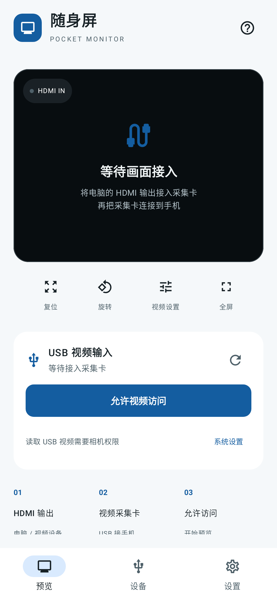
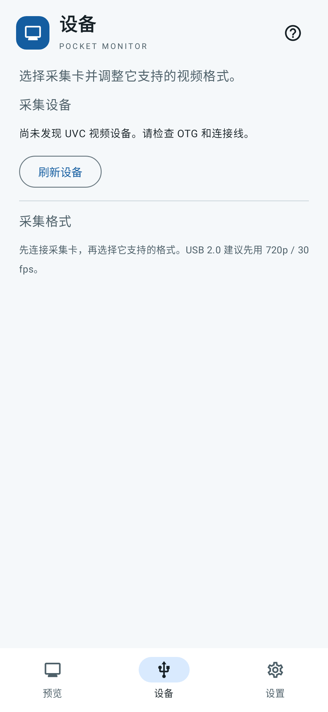
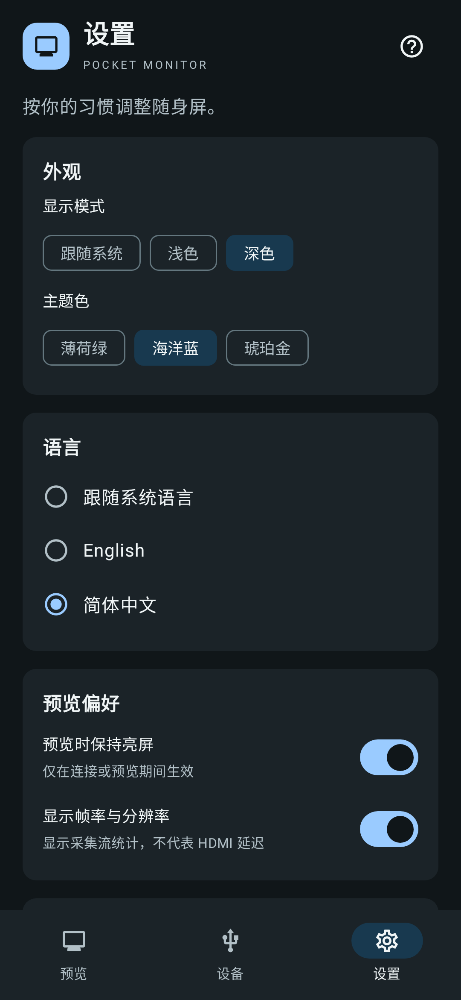

<h1 align="center">随身屏 · Pocket Monitor</h1>

<p align="center"><strong>用 Android 手机，查看电脑的 HDMI 画面。</strong></p>
[English](README.md) · **简体中文**

**[下载 Android APK](https://github.com/ttermish/pocket-monitor/releases/download/v0.1.4/pocket-monitor-0.1.4-release.apk)** · [界面截图](#界面预览) · [开始使用](#三步开始使用) · [文档导航](docs/README.md) · [反馈问题](https://github.com/ttermish/pocket-monitor/issues/new/choose)

随身屏是一款便携视频监视器 App。把电脑的 HDMI 输出接入 USB 视频采集卡，再把采集卡连接到手机，就能在手机上预览画面，电脑无需安装发送端程序。

适合想把手机当作临时小屏幕、查看另一台电脑视频输出的场景。当前为 **0.1.4 开发测试版，支持 Android 8.0 及以上**；具体手机与采集卡组合仍需实测。

## 界面预览

| 预览 | 设备 | 设置 |
| :---: | :---: | :---: |
| [](docs/images/preview-zh.png) | [](docs/images/devices-zh.png) | [](docs/images/settings-zh.png) |

[逐张查看截图](docs/images/README.md)。仓库与图片已公开，无需登录。离线阅读请[下载离线文档包](https://github.com/ttermish/pocket-monitor/releases/download/v0.1.4/pocket-monitor-0.1.4-docs.zip)并解压，保留 README 旁的 `docs/images/` 目录。

**预览 · 设备 · 设置。** 截图来自应用实际界面的自动化渲染，展示浅色和深色外观下未连接采集卡的状态；目前尚未完成真实 HDMI 采集验收。

## 可以做什么

- **查看 HDMI 视频**：通过 UVC 采集卡接收电脑等设备的画面。
- **放大看细节**：双指缩放、拖动画面，支持全屏和 90° 旋转。
- **调整清晰度与流畅度**：从采集卡支持的格式中选择分辨率和帧率。
- **记住可用格式**：持续出帧至少 3 秒后保存该型号采集卡的格式，下次优先使用。
- **按习惯调整界面**：浅色、深色或跟随系统，薄荷绿、海洋蓝、琥珀金三种配色；简体中文、English 或跟随系统语言，偏好自动保存。
- **本地预览**：不录制、不上传视频；切到后台时停止采集，返回后尝试恢复。

当前仅支持视频预览，不包含声音、录制、截图或键鼠回传；尚未提供 iPhone 版本。

## 准备哪些设备

| 需要 | 说明 |
| --- | --- |
| Android 手机 | Android 8.0+，支持 USB Host / OTG；部分手机需在设置中开启 OTG |
| UVC 视频采集卡 | HDMI IN 接电脑，USB 一侧接手机 |
| HDMI 线与数据线 | 接口不匹配时增加 OTG 转接器；确保支持数据传输 |
| HDMI 视频来源 | 有 HDMI 输出的电脑或其他设备；只有 USB-C 的电脑需支持视频输出的转接器 |

**普通 USB-C 转 HDMI 投屏线不能替代采集卡。** 采集卡负责把 HDMI 输入转换成手机能读取的 USB 视频。

## 安装

[下载签名 Android APK](https://github.com/ttermish/pocket-monitor/releases/download/v0.1.4/pocket-monitor-0.1.4-release.apk) · [发行说明、源码与校验值](https://github.com/ttermish/pocket-monitor/releases/tag/v0.1.4)

APK 已公开下载，无需登录。开发者也可按[构建指南](docs/DEVELOPMENT.md)生成安装包。

| 文件 | 用途 |
| --- | --- |
| `*-release.apk` | 在 Android 手机上安装。 |
| `*-release.aab` | 商店分发使用，不能直接安装。 |
| [`*-source.zip`](https://github.com/ttermish/pocket-monitor/releases/download/v0.1.4/pocket-monitor-0.1.4-source.zip) | 源码与完整文档，包含界面截图。 |
| [`*-docs.zip`](https://github.com/ttermish/pocket-monitor/releases/download/v0.1.4/pocket-monitor-0.1.4-docs.zip) | 双语指南和截图，完整解压后离线阅读。 |
| `SHA256SUMS` | 核对下载文件是否完整，见[下载说明](docs/DOWNLOADS.md)。 |

新标签页面如果只显示 **Source code**，说明该版本的 APK 尚未发布；等待 **Android Release** 工作流完成，再从 **Assets** 下载 `.apk`，或直接点击上面的 APK 链接。Source code 是源码，不是安装包。

在手机打开 APK，按系统提示允许该来源安装应用。Release 包使用专用签名，与本地 Debug 包不同，不能直接覆盖已有 Debug 安装；卸载旧版本会清除已保存的格式设置。AAB 用于商店分发，不能直接安装。

## 三步开始使用

### 1. 连接电脑、采集卡和手机

```text
电脑 HDMI 输出 → HDMI 线 → 采集卡 HDMI IN
                               │
                           USB / OTG
                               │
                          Android 手机
```

采集卡的 HDMI 接口接视频来源，USB 接口接手机。确认电脑正在输出画面，手机已开启 OTG（如果系统需要）。

### 2. 打开随身屏并允许访问

点击「允许视频访问」，授予相机权限；发现设备后点击「连接采集卡」，在系统 USB 访问弹窗中选择允许。未发现设备时点击刷新，或「查找采集卡」。

连接多张采集卡时，可从「设备」标签选择设备。建议第一次只连接一张，方便确认输入来源。

### 3. 设置电脑的显示输出

以 Mac 为例，在「系统设置 → 显示器」里选择镜像已有屏幕，手机即可显示同一桌面；选择扩展显示时，将窗口移到新出现的显示器上。

可先尝试 1920 × 1080、60Hz 的电脑输出，并以 App 默认优先选择的 720p / 30 fps MJPEG 开始采集。电脑输出和手机采集的规格可以不同，最终以采集卡实际支持为准。

## 怎么调整画面

| 操作 | 用法 |
| --- | --- |
| 全屏 | 点击「全屏」，通过右上角按钮退出 |
| 旋转 | 每次点击「旋转」转动 90° |
| 缩放与移动 | 在预览区域双指缩放，放大后拖动查看细节 |
| 恢复显示 | 双击画面恢复缩放与位置；点击「复位」还会恢复旋转 |
| 切换格式 | 连接后打开「设备」标签或「视频设置」，选择设备支持的分辨率、帧率和编码 |
| 停止预览 | 点击「停止预览」，或在「设备」页中断开连接 |

格式越高不一定越流畅，实际表现取决于 USB 带宽、采集卡和手机供电。默认优先选择接近 720p / 30 fps 的 MJPEG；稳定出帧的格式按采集卡型号记忆，同型号设备共用。

## 设置外观与语言

打开底部「设置」标签，可选择「跟随系统 / 浅色 / 深色」显示模式，以及「薄荷绿 / 海洋蓝 / 琥珀金」主题色。语言支持简体中文、English 和跟随系统，切换后即时生效；暂未支持的系统语言使用英文。

「预览偏好」可关闭保持亮屏，或隐藏帧率与分辨率。偏好保存在手机本地，重启后仍有效；「关于 → 开源许可」可离线查看随包附带的第三方声明。

三个标签分别管理预览、采集设备和应用偏好。切换标签会保留预览组件；当前一次只连接一张采集卡，不支持多路同时采集。离开应用进入后台时停止采集。

## 遇到问题

**找不到采集卡？** 检查 OTG 开关、数据线、转接器和供电，确认使用的是 UVC 采集卡。普通投屏线不能输入视频。

**拒绝权限后无法连接？** 重新点击授权。系统不再弹窗时，从「系统设置」开启相机权限，然后重新连接并允许 USB 访问。

**提示无法打开设备？** 关闭其他占用采集卡的应用，拔插后再试。

**有彩条或黑屏，却显示「实时画面」？** 部分采集卡会自己生成彩条或无信号画面。App 收到视频帧不代表电脑已正常输出；请检查 HDMI 线、电脑显示设置和采集卡供电。HDCP 加密内容不在支持范围内。

**一直等待画面或视频中断？** 启动 8 秒无帧时，App 最多尝试两次较低规格。仍无画面时检查连接，或在「设备」页中手动切换格式；已经出画后的断流不会反复自动重连。

**切到后台后画面停止？** 这是正常行为。采集仅在前台运行，返回 App 后会尝试恢复；如未恢复，可手动重新连接。

## 反馈与参与

遇到问题可[提交 Issue](https://github.com/ttermish/pocket-monitor/issues)，附上手机型号、Android 版本、采集卡型号、视频格式和复现步骤。欢迎分享真实设备的兼容性结果；请先移除日志和截图中的个人信息。

项目许可证仍待所有者选择，尚未添加根目录 LICENSE；第三方组件许可单独列于下方。

- [文档导航](docs/README.md)
- [隐私说明](docs/PRIVACY.md) · [硬件兼容性](docs/COMPATIBILITY.md) · [功能计划](docs/ROADMAP.md)
- [贡献指南](CONTRIBUTING.zh-CN.md) · [安全问题报告](SECURITY.zh-CN.md)
- [开发与构建](docs/DEVELOPMENT.md) · [开发约定](AGENTS.md)
- [更新记录](CHANGELOG.md) · [验证记录](docs/VALIDATION.md)
- [第三方组件与许可](THIRD_PARTY_NOTICES.md) · [发行资料](docs/RELEASING.md)
